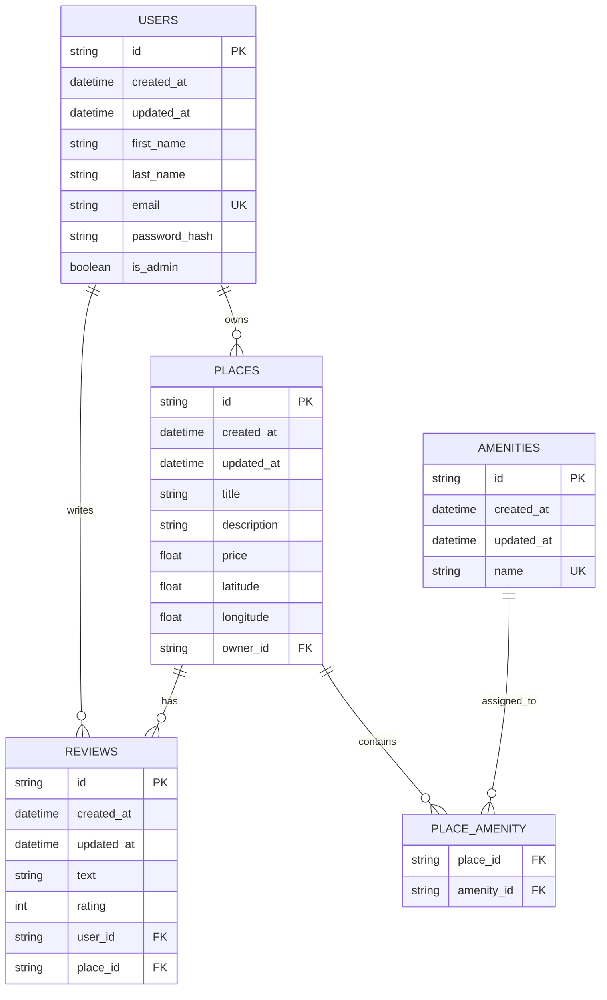

# HBnB Project - Part 3: Enhanced Backend with Authentication and Database Integration

Welcome to Part 3 of the HBnB Project. In this phase, the backend application is transitioned from an in-memory repository to a persistent relational database using SQLAlchemy and SQLite. Additionally, secure user sessions, JWT-based authentication, and role-based access control (RBAC) are introduced.

## Objectives
* Authentication & Authorization: Implement secure JWT-based user login and protect endpoints based on user roles (is_admin).
* Database Integration: Replace temporary in-memory storage with an SQLite database using SQLAlchemy ORM for development.
* Data Consistency: Define database schemas, models, and constraints to ensure data integrity.
* Data Relationships: Map one-to-many and many-to-many relationships between Users, Places, Reviews, and Amenities.

---

## Project Structure

part3/
├── app/
│   ├── __init__.py           # Application Factory & Extension Initialization
│   ├── api/
│   │   └── v1/
│   │       ├── auth.py       # JWT Login and Token Management
│   │       ├── users.py      # Secure User Management Endpoints
│   │       └── amenities.py  # Admin-only Amenity Management
│   ├── models/
│   │   ├── base.py           # Shared BaseModel class with ID & Timestamps
│   │   ├── user.py           # User Model with Password Hashing
│   │   ├── place.py          # Place Model & place_amenity Association Table
│   │   ├── review.py         # Review Model
│   │   └── amenity.py        # Amenity Model
│   ├── persistence/
│   │   ├── sqlalchemy_repository.py  # Generic Database CRUD Repository
│   │   └── user_repository.py        # User-specific Database Queries
│   └── services/
│       └── facade.py         # Refactored Service Layer linking App to DB
├── config.py                 # Development & Production Configuration Environment
├── init_db.sql               # Pure SQL Script for Database Schema & Seed Data
└── run.py                    # Application Entry Point

---

## Database Schema (ER Diagram)

The database structure and relationships are modeled as follows:

---

## Setup & Installation

### 1. Initialize the SQLite Database
To generate the tables and populate the database with initial seed data (including an administrator account and basic amenities), run the following command in your terminal:

sqlite3 development.db < init_db.sql

### 2. Run the Application
Start the Flask development server:

python run.py
